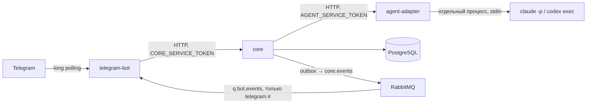

# Карандаш

Монорепозиторий Telegram-сервиса персонального учёта питания. Проект рассчитан на внутренний пилот до трёх пользователей и строится как несколько отдельно запускаемых приложений с единым ядром предметной области.

## Модули

- `contracts` — общие контракты HTTP и событий, в том числе контракт распознавания и его проверка (`RecognitionContract`);
- `core` — учётные записи, цели, дневник, расчёты, уведомления, каталог, модель и transactional outbox. Единственный сервис с доступом к базе;
- `agent-adapter` — запускает CLI-агента (`claude -p` или `codex exec`) отдельным процессом и возвращает результат распознавания;
- `telegram-bot` — приёмщик Telegram без состояния: long polling, передаёт сообщения в ядро и отправляет ответы;
- `tavern`, `yandex-lavka`, `samokat`, `lifemart` — адаптеры меню. Пока это безопасные заглушки с пустой выдачей. Для `tavern` сохранён технический псевдоним `sd-menu`.

## Контур

В кластере `core` и PostgreSQL работают на ноде в РФ, RabbitMQ — общий с Дымоходом (тоже РФ, отдельный vhost `karandash`), `telegram-bot` и `agent-adapter` — на зарубежной ноде. Зарубежные сервисы не имеют доступа к базе, ничего не сохраняют и не пишут в логи содержимое сообщений и фото. Манифесты и порядок выката — [deploy/k8s/README.md](deploy/k8s/README.md).

- Приёмщик скачивает фото в память и передаёт его ядру, ядро — агенту; ответ пользователю ядро возвращает готовым текстом.
- Ядро отсекает повторную доставку апдейта по `update_id`, заводит аккаунт по `telegram_id` и пишет `usage_record` на каждый вызов модели.
- Асинхронные уведомления: `TelegramNotifications` в ядре → outbox → `q.bot.events` → приёмщик.
- CLI-агент запускается без инструментов, MCP и пользовательских настроек, в пустом временном каталоге, с окружением по белому списку; пользовательский ввод идёт только через stdin. Таймаут убивает всё дерево процессов, есть лимиты параллельных вызовов и объёма вывода.

## Локальный запуск

1. Скопировать `.env.example` в `.env`, заменить пароли и сервисные токены (`CORE_SERVICE_TOKEN`, `AGENT_SERVICE_TOKEN`).
2. Учётные данные CLI — `ANTHROPIC_API_KEY` (или `CLAUDE_CODE_OAUTH_TOKEN`) в `.env` или в окружении, из которого запускается compose. В образ и в git они не попадают.
3. Весь контур: `docker compose up -d --build`. Только инфраструктура, как раньше: `docker compose up -d postgres rabbitmq prometheus grafana`.
4. Без `TELEGRAM_BOT_TOKEN` приёмщик запускается с выключенным опросом Telegram. Внутренний API ядра можно проверить напрямую: `POST /internal/telegram/messages` с заголовком `Authorization: Bearer <CORE_SERVICE_TOKEN>`.

Если порты 8080, 8081 или 8095 заняты, их можно переопределить в `.env`: `CORE_HOST_PORT`, `BOT_HOST_PORT`, `AGENT_HOST_PORT`.

Для сборки нужен JDK 21 в `JAVA_HOME`: Gradle 8.14 не запускается на более новых JDK.

### Выбор модели

`AI_PROVIDER` (`karandash.ai.provider`): `disabled` — по умолчанию, `openai-compatible` — прежний OpenAI-совместимый адаптер (`GPT_*`), `agent` — агент-адаптер. Прежний флаг `GPT_ENABLED=true` заменён на `AI_PROVIDER=openai-compatible`.

Агент-адаптер: `AGENT_CLI=claude|codex`, модель — `AGENT_CLAUDE_MODEL` или `AGENT_CODEX_MODEL`. Образ собирается с `claude` 2.1.268; Codex ставится аргументом сборки `CODEX_VERSION`. Реализация для `claude` проверена на настоящем CLI, для `codex` — только на фейковом: до боевого использования её нужно проверить на настоящем бинарнике.

Секреты не должны попадать в Git. Фотографии обрабатываются в памяти и не сохраняются.

## Решения первой версии

- Java 21, Spring Boot 3, PostgreSQL и RabbitMQ;
- `ru.karandash` как корневой пакет;
- расчёты цели выполняются детерминированно, модель используется только для распознавания и рекомендаций;
- модель подключается либо через OpenAI-совместимый, полностью настраиваемый адаптер, либо через агент-адаптер с CLI-агентом;
- ответ модели всегда проверяется одним контрактом распознавания, независимо от провайдера;
- события публикуются из transactional outbox в JSON и допускают повторную доставку;
- внутренние API сервисов закрыты сервисными токенами; пустой токен закрывает API полностью;
- предупреждение о приближении к верхней границе по умолчанию срабатывает на 90%, а превышение — на 100%; оба порога настраиваются;
- возраст хранится как параметр расчёта, но пользователь не блокируется по возрасту.
